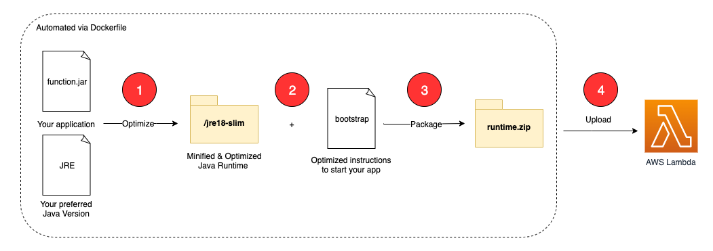

# AWS Lambda custom runtime based on minimal Java 18 JRE
An AWS Lambda custom runtime to enable Java 18 support on a minimalistic JRE, which only includes the Java modules required by the application.



1.	Use the application code (uber.jar), download the preferred Java version and create a bootstrap file with optimized starting instructions for the application.
2.	Take advantage of using jdeps and jlink to create a minified Java runtime based on the application needs, start the app with Class Data Sharing enabled to get the classes file for later start optimizations and build the runtime.zip out of those components
3.	Deploy the runtime, including the app, to AWS Lambda via AWS CDK

## Getting started

1. Download or clone the repository.
   
2. install prerequisite software:
    1. Install [AWS CDK](https://docs.aws.amazon.com/cdk/latest/guide/getting_started.html)   
    2. Install [Docker](https://docs.docker.com/get-docker/)

3. Build and package the AWS Lambda function and create the AWS Lambda custom runtime using Docker:

```bash
./build.sh
```

4. Provision the AWS infrastructure (Amazon API Gateway, AWS Lambda and Amazon DynamoDB) using AWS CDK:

```bash
./provision-infrastructure.sh
```

The API Gateway endpoint URL is displayed in the output and saved in the file `infrastructure/target/outputs.json`. The contents are similar to:

```
{
  "LambdaCustomRuntimeMinimalJRE18InfrastructureStack": {
    "apiendpoint": "https://<API_ID>.execute-api.<AWS_REGION>.amazonaws.com"
  }
}
```

## Using Artillery to test the changes

First, install prerequisites:

1. Install [jq](https://stedolan.github.io/jq/) and [Artillery Core](https://artillery.io/docs/guides/getting-started/installing-artillery.html)
2. Run the following script from the projects root directory:

```bash
artillery run -t $(cat infrastructure/target/outputs.json | jq -r '.LambdaCustomRuntimeMinimalJRE18InfrastructureStack.apiendpoint') -v '{ "url": "/custom-runtime" }' infrastructure/loadtest.yml
```


### Check results in Amazon CloudWatch Insights

1. Navigate to Amazon **[CloudWatch Logs Insights](https://console.aws.amazon.com/cloudwatch/home?#logsV2:logs-insights)**.
2. Select the log groups `/aws/lambda/custom-runtime-java-18` from the drop-down list
3. Copy the following query and choose **Run query**:

```
 filter @type = "REPORT"
    | parse @log /\d+:\/aws\/lambda\/(?<function>.*)/
    | stats
    count(*) as invocations,
    pct(@duration+coalesce(@initDuration,0), 0) as p0,
    pct(@duration+coalesce(@initDuration,0), 25) as p25,
    pct(@duration+coalesce(@initDuration,0), 50) as p50,
    pct(@duration+coalesce(@initDuration,0), 75) as p75,
    pct(@duration+coalesce(@initDuration,0), 90) as p90,
    pct(@duration+coalesce(@initDuration,0), 95) as p95,
    pct(@duration+coalesce(@initDuration,0), 99) as p99,
    pct(@duration+coalesce(@initDuration,0), 100) as p100
    group by function, ispresent(@initDuration) as coldstart
    | sort by coldstart, function
```


You see results similar to:


For cold-starts only you will see results similar to:


## Security

See [CONTRIBUTING](CONTRIBUTING.md#security-issue-notifications) for more information.

## License

This library is licensed under the MIT-0 License. See the LICENSE file.
